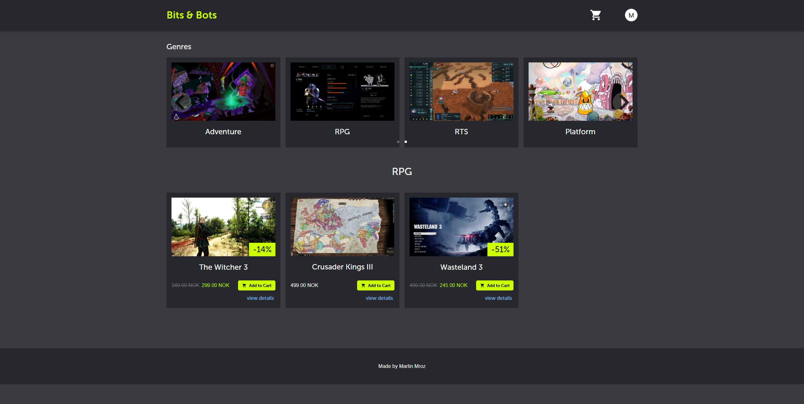
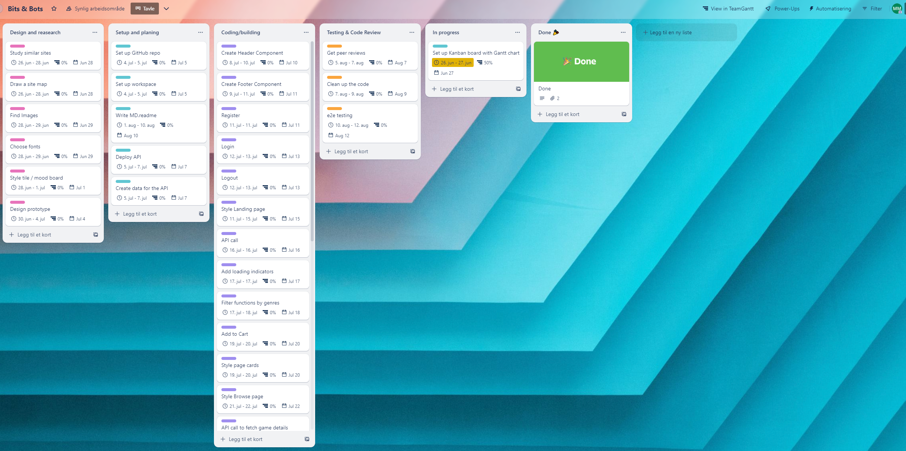
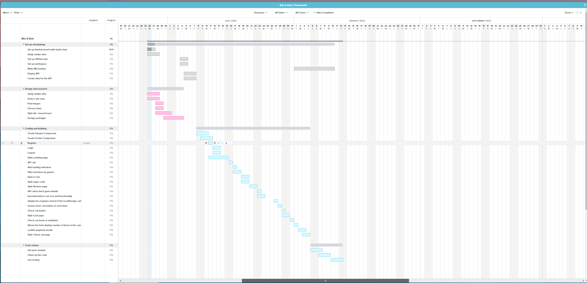

# Bits & Bots: A Video Game Store Website

Welcome to the Bits & Bots project. This repository houses the code and related resources for the video game store website called Bits & Bots. The website offers a range of functionalities tailored to provide the best user experience to its audience.

## Project Overview

- **Name**: Bits & Bots
- **Type**: Video Game Store Website
- **Features**:
  - User Registration and Login
  - Browse Games by Genre
  - View Game Details
  - Add Games to Cart
  - Checkout System
  - Logout Feature

## Table of Contents

1. [Installation](#installation)
2. [Usage](#usage)
3. [Design and Planning Tools](#design-and-planning-tools)
4. [Technologies Used](#technologies-used)
5. [Backend Architecture](#backend-architecture)
6. [Contributing](#contributing)
7. [Dependencies](#dependencies)
8. [License](#license)

### Installation

1. Clone the repository: `git clone https://github.com/martinMr79/bits-and-bots`
2. Install the dependencies: `npm install`
3. Start the application: `npm start`

## Usage

### Landing Page
- Features a fullscreen video or slideshow with user login and registration form.

### Browse Page
- Users can view and search for games by different genres.
- Add or remove games from the cart.

### Details Page
- View detailed information about a specific game.

### Cart Page
- View and manage games in the cart.
- Proceed to checkout.

### Checkout Page
- Fill out the form with personal and payment details.
- Finalize the purchase.

## Design and Planning Tools

For designing the user interface and user experience, i used Adobe XD

Our project planning was carried out using Trello, a web-based Kanban-style list-making application. I used a Gantt chart for project timing.

Trello board: 

Gant Chart:

## Technologies Used

- **React**: For building the user interface.
- **Styled Components with sass syntax**: For efficient styling.
- **WordPress API**: Backend operations.
- **MUI**: Design components.

## Backend Architecture

### WooCommerce:
WooCommerce is an open-source e-commerce plugin for WordPress. It enables the user to manage and handle e-commerce functionalities

### Headeless Mode:
This plugin turns your WordPress site into a headless CMS by blocking all frontend requests and only allowing the REST API and WPGraphQL. It helps ensure that WordPress serves only as a backend.

### Advanced Custom Fields (ACF):
ACF is a WordPress plugin that allows you to add custom fields to your content. It provides an intuitive interface to add extra fields like text, images, and more. It's essential for creating custom content structures and expanding the capabilities of our headless CMS.

## Contributing

Feel free to fork this repository and submit pull requests.

## Dependencies

This project uses several dependencies for its functionality:

- [React Router DOM](https://reactrouter.com/) - for handling routing: `npm install react-router-dom`
- [Material UI styled](https://mui.com/material-ui/) - for UI components: `npm install @mui/material @emotion/react @emotion/styled` 
- [Material UI icons](https://mui.com/) - for UI icons: `npm install @mui/icons-material`
- [Zustand](https://www.npmjs.com/package/zustand) - for state management: `npm install zustand`
- [immer](https://immerjs.github.io/immer/) - Allows you to work with immutable state in a more convenient way: `npm install immer`
- [Axios](https://www.npmjs.com/package/axios) - for making HTTP requests: `npm install axios`
- [Styled Components](https://www.npmjs.com/package/styled-components) - for styling components: `npm install styled-components`
- [react-responsive-carousel](https://www.npmjs.com/package/react-responsive-carousel) - A responsive carousel component for React: `npm install react-responsive-carousel`
- [react-modal](https://www.npmjs.com/package/react-modal) - Accessible modal dialog component for React: `npm install react-modal`

## License

This project is licensed under the MIT License.

